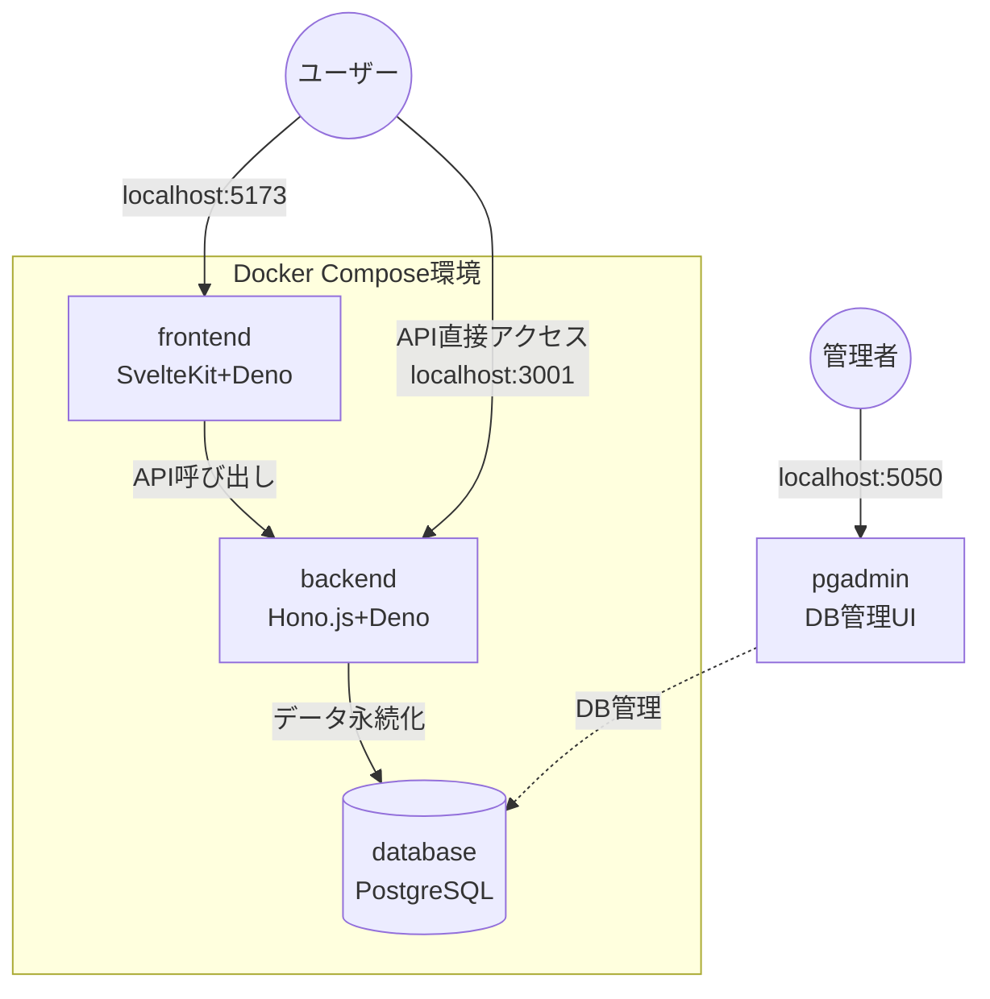
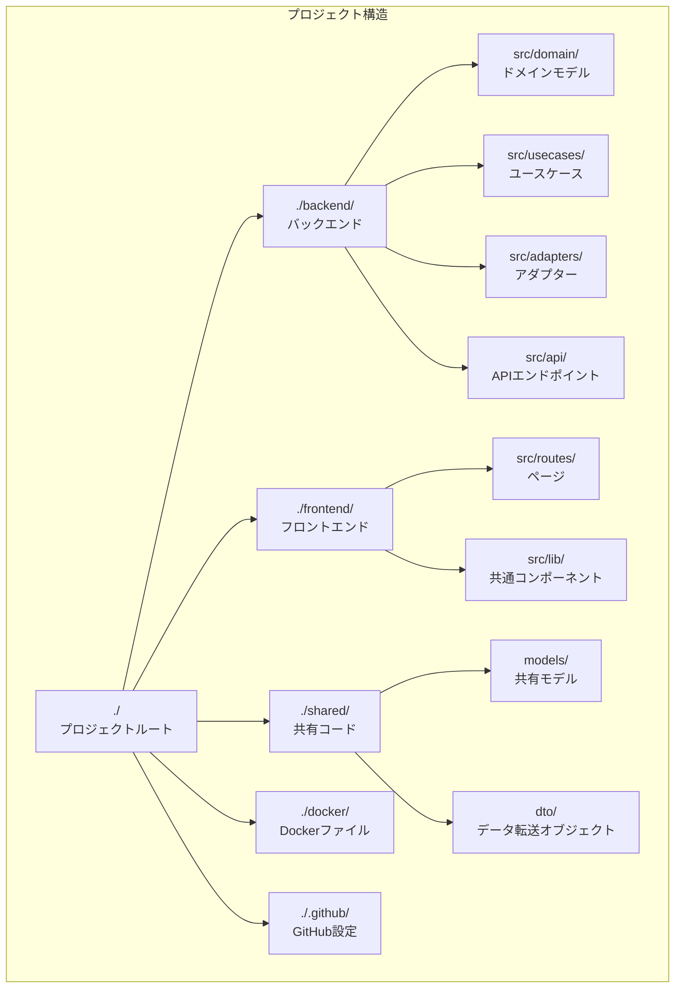
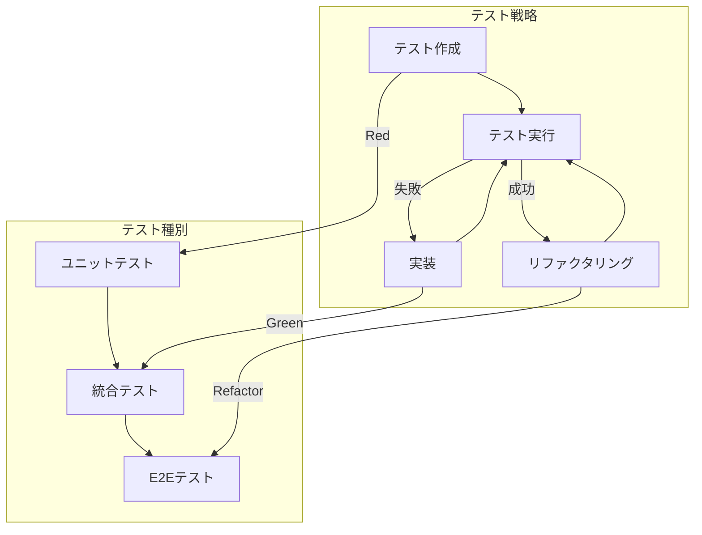
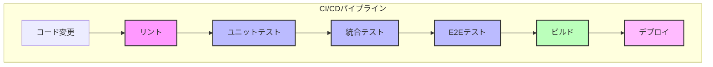

# 🚀 Serverless Boilerplate


> フルスタックTypeScript・モノレポ構成によるサーバレスWebアプリケーション構築ボイラープレートです。
> TDDとクリーンアーキテクチャを基盤とした開発環境を提供します。

<div align="center">
  
  
  
</div>

---

## 📋 目次

- [機能と特徴](#-機能と特徴)
- [アーキテクチャ](#-アーキテクチャ)
- [はじめ方](#-はじめ方)
- [Docker環境](#-docker環境)
- [プロジェクト構造](#-プロジェクト構造)
- [開発ガイド](#-開発ガイド)
- [テスト戦略](#-テスト戦略)
- [CI/CD](#-cicd)
- [デプロイ](#デプロイ)
- [FAQ](#-faq)
- [ライセンス](#-ライセンス)

---

## ✨ 機能と特徴

### 技術スタック
- **フロントエンド**: SvelteKit + TailwindCSS (Deno上で実行)
- **バックエンド**: Hono.js + Deno
- **データベース**: PostgreSQL + Drizzle ORM
- **テスト**: Deno Test, Playwright
- **開発環境**: Docker, Docker Compose
- **その他**: TypeScript, Zod, ESLint, Prettier

### 主要機能
- 📱 **モダンなUI**: TailwindCSSによるレスポンシブデザイン
- 🔒 **型安全**: エンドツーエンドでTypeScriptを活用
- 🧪 **テスト駆動**: 包括的なテスト戦略とツール
- 🏛️ **クリーンな設計**: 実用的なクリーンアーキテクチャ
- 🔄 **CI/CD**: GitHub Actionsによる自動化パイプライン
- 🚀 **高速開発**: 開発効率を高める各種ツール
- 🐳 **Docker対応**: 完全なコンテナ化開発環境

---

## 🏛️ アーキテクチャ

このボイラープレートは、実用性とスケーラビリティのバランスを考慮した**実践的クリーンアーキテクチャ**を採用しています。

<div align="center">
  
</div>

### テスト駆動開発 (TDD)
- **ユニットテスト**: ドメインロジックの単体テスト (Vitest/Deno Test)
- **統合テスト**: API・サービス間連携のテスト
- **E2Eテスト**: フロントエンドからバックエンドまでの結合テスト (Playwright)
- **CI/CD**: GitHub Actionsによる自動テスト実行

### クリーンアーキテクチャの採用
プロジェクトに適した実用的なクリーンアーキテクチャを採用しています：

> Domain Layer → Use Cases → Adapters → External Interfaces

- **ドメイン層**: ビジネスロジックとエンティティ
- **ユースケース層**: アプリケーションロジック
- **アダプター層**: リポジトリ実装、外部API連携
- **インターフェース層**: APIエンドポイント、UI

### 実践的アプローチ
- **段階的採用**: 必要に応じて段階的にクリーンアーキテクチャを適用可能
- **TDDファースト**: テスト駆動の開発サイクルを最優先
- **サーバレス最適化**: クラウドネイティブなアーキテクチャに適した設計
- **開発速度と品質のバランス**: 過剰な抽象化を避けた実用的な構造

---

## 🚀 はじめ方

### 前提条件
- Deno 2.2.3+
- Docker & Docker Compose

### セットアップ

```bash
# リポジトリをクローン
git clone https://github.com/yourusername/serverless-boilerplate.git my-project
cd my-project

# 環境変数を設定
cp .env.example .env
# .envファイルを編集して環境設定を行います

# Docker Composeで環境を起動
docker-compose up -d

# または手動セットアップの場合
deno task setup
```

### 開発環境へのアクセス
- フロントエンド: http://localhost:5173
- バックエンドAPI: http://localhost:3001
- API ドキュメント: http://localhost:3001/docs
- データベース管理UI: http://localhost:5050 (PgAdmin)

---

## 🐳 Docker環境

このプロジェクトは完全なDocker化環境を提供し、開発からテスト、本番デプロイまでをサポートします。

### Docker構成概要


プロジェクトは以下のDocker構成を使用しています：

```txt
docker/
├── backend.Dockerfile  # バックエンド用Dockerfile（Deno）
├── frontend.Dockerfile # フロントエンド用Dockerfile（Deno）
├── db.Dockerfile       # PostgreSQL用Dockerfile
└── init-db.sql         # データベース初期化スクリプト
```

### Docker Composeサービス

`docker-compose.yml`は以下のサービスを定義しています：

- **backend**: Denoによるバックエンドサービス（Hono.js）
- **frontend**: Denoによるフロントエンドサービス（SvelteKit）
- **db**: PostgreSQLデータベース（サンプルデータ自動作成）
- **pgadmin**: データベース管理UI（オプション）




### Docker環境の主な特徴

- **マルチステージビルド**: 高速なビルドとスリムなイメージサイズ
- **ボリューム管理**: コード変更の即時反映とデータ永続化
- **依存関係キャッシュ**: ビルド時間の大幅短縮
- **開発/本番環境の統一**: どこでも同じ動作を保証
- **ホットリロード**: コード変更時の自動再読み込み

### Docker環境の使用方法

```bash
# 全サービスを起動
docker-compose up -d

# 開発中のログを確認
docker-compose logs -f

# 特定のサービスのみ再起動
docker-compose restart frontend

# 環境を停止（データを保持）
docker-compose down

# 環境を完全に削除（データも削除）
docker-compose down --volumes
```

### 環境変数カスタマイズ

`.env`ファイルで以下の設定をカスタマイズできます：

```bash
# ポート設定
BACKEND_PORT=3001
FRONTEND_PORT=5173
DB_PORT=5433

# データベース設定
DB_USER=postgres
DB_PASSWORD=postgres
DB_NAME=app_db

# アプリケーション設定
JWT_SECRET=dev-secret-key
LOG_LEVEL=info
```

詳細は[Docker環境設定ガイド](docker/README.md)を参照してください。

---

## 📂 プロジェクト構造



```txt
serverless-boilerplate/
├── .github/          # GitHub設定ファイル
│   └── workflows/    # GitHub Actionsワークフロー
│       └── ci.yml    # 統合CI/CDワークフロー
├── backend/          # バックエンドアプリケーション（Hono.js + Deno）
│   ├── .vscode/      # VSCode設定
│   ├── deno.json     # Deno設定
│   ├── main.ts       # エントリーポイント
│   ├── src/
│   │   ├── domain/   # ドメインモデルとロジック
│   │   ├── usecases/ # アプリケーションユースケース
│   │   ├── adapters/ # 外部サービス連携・リポジトリ実装
│   │   └── api/      # APIエンドポイント
│   └── tests/        # バックエンドテスト
├── frontend/         # フロントエンドアプリケーション（SvelteKit）
│   ├── src/          # ソースコード
│   │   ├── lib/      # ユーティリティ・ライブラリ
│   │   └── routes/   # SvelteKitルート（ページ）
│   ├── static/       # 静的ファイル
│   └── tests/        # フロントエンドテスト
├── shared/           # 共有コード・型定義
│   ├── models/       # 共有モデル
│   ├── dto/          # データ転送オブジェクト
│   └── utils/        # 共通ユーティリティ
├── tools/            # 開発・デプロイツール
├── docker/           # Dockerファイル
│   ├── backend.Dockerfile
│   ├── frontend.Dockerfile
│   ├── db.Dockerfile
│   └── init-db.sql
└── docker-compose.yml # Docker Compose設定
```

---

## 💻 開発ガイド

### Docker環境を使用した開発

```bash
# Docker環境の起動
docker-compose up -d

# ログのモニタリング
docker-compose logs -f

# 特定サービスのみ再ビルド
docker-compose build frontend
docker-compose up -d --no-deps frontend
```

### バックエンド (Hono.js + Deno)

```bash
# バックエンド開発サーバー起動（Docker外で実行する場合）
cd backend && deno task dev

# 単体テスト実行
deno task test:unit

# 統合テスト実行
deno task test:integration

# 全テスト実行
deno task test
```

### フロントエンド (SvelteKit + Deno)

```bash
# フロントエンド開発サーバー起動（Docker外で実行する場合）
cd frontend && deno task dev

# コンポーネントテスト実行
deno task test:unit

# E2Eテスト実行
deno task test:e2e
```

---

## 🧪 テスト戦略



### TDD実践ガイド

#### バックエンドでのTDD
```bash
# 1. テストファイル作成 (例: ユーザー作成機能)
touch backend/tests/unit/domain/user-creation.test.ts

# 2. テスト実行 (失敗確認)
cd backend && deno task test

# 3. 実装
# domain/models/user.ts などを実装

# 4. テスト実行 (成功確認)
deno task test

# 5. リファクタリング
# コードをリファクタリングし、テストを再実行
```

#### フロントエンドでのTDD
```bash
# 1. コンポーネントテスト作成
touch frontend/tests/unit/UserProfile.test.ts

# 2. テスト実行
cd frontend && deno task test:unit

# 3. コンポーネント実装
# 4. テスト再実行
# 5. リファクタリング
```

### テスト自動化ツール

```bash
# テスト監視モード（変更を検知して自動実行）
deno task test:watch

# テストカバレッジレポート生成
deno task coverage

# E2Eテストのみ実行
deno task test:e2e
```

---

## 🏗️ クリーンアーキテクチャ実装ガイド

### 実装例

#### ドメインモデル
```typescript
// backend/src/domain/models/user.ts
export class User {
  constructor(
    public readonly id: string,
    public name: string,
    public email: string,
    public readonly createdAt: Date
  ) {}
  
  // ファクトリメソッド - バリデーション付き
  static create(props: { name: string; email: string }): Result<User, ValidationError> {
    const { name, email } = props;
    
    // 基本的なバリデーション
    if (!name || name.length < 2) {
      return err(new ValidationError('名前は2文字以上必要です'));
    }
    
    if (!email || !email.includes('@')) {
      return err(new ValidationError('有効なメールアドレスが必要です'));
    }
    
    // バリデーション成功 - 新しいエンティティを作成
    return ok(new User(
      crypto.randomUUID(),
      name,
      email,
      new Date()
    ));
  }
}
```

#### ユースケース実装
```typescript
// backend/src/usecases/create-user.ts
export class CreateUserUseCase {
  constructor(
    private userRepository: UserRepository,
    private emailService: EmailService
  ) {}
  
  async execute(command: { name: string; email: string }): Promise<Result<string, ApplicationError>> {
    // 1. 重複確認
    const existingUser = await this.userRepository.findByEmail(command.email);
    if (existingUser) {
      return err(new ApplicationError('このメールアドレスは既に登録されています'));
    }
    
    // 2. ユーザー作成
    const userResult = User.create(command);
    if (userResult.isErr()) {
      return err(userResult.error);
    }
    
    // 3. ユーザー保存
    try {
      await this.userRepository.save(userResult.value);
      return ok(userResult.value.id);
    } catch (error) {
      return err(new ApplicationError('ユーザーの保存に失敗しました'));
    }
  }
}
```

---

## 🔄 CI/CD



このプロジェクトは、GitHub Actionsを使用したCI/CDパイプラインを提供しています。

### CI/CDワークフロー概要

> コード変更 → リント → ユニットテスト → 統合テスト → E2Eテスト → ビルド → デプロイ

### 提供されている機能

- **自動リント**: コードスタイルと品質チェック
- **自動テスト**: バックエンド・フロントエンドの全テスト自動実行
- **E2Eテスト**: Playwrightによるブラウザテスト
- **自動ビルド**: 最適化されたビルド成果物の生成
- **自動デプロイ**: mainブランチへのマージ時に自動デプロイ

### CI/CD最適化について

#### ビルド高速化
- **キャッシュ戦略**: 依存関係やビルド成果物のキャッシュ
- **並列実行**: 独立したタスクを並列実行
- **テスト分割**: 大規模テストの分割実行

#### デプロイ最適化
- **段階的デプロイ**: カナリアリリースやブルー/グリーンデプロイ
- **自動ロールバック**: テスト失敗時の自動復旧
- **環境変数管理**: 安全な環境変数の取り扱い

---

## 🛠️ 開発効率化ツール

### コード生成ツール
```bash
# 新しいドメインモデルとテストの生成
deno run -A tools/generators/generate-domain-model.ts --name Task

# ユースケースとテストの生成
deno run -A tools/generators/generate-usecase.ts --name CreateTask

# 新しい機能の開発開始（テスト・実装のファイル作成）
deno task new:feature user-registration
```

### VSCode拡張機能の推奨
- **Test Explorer UI**: テストを視覚的に管理・実行
- **Coverage Gutters**: コードカバレッジを視覚化
- **Error Lens**: エラーをインラインで表示
- **Todo Tree**: TODOコメントを一覧表示
- **Deno**: Denoランタイムサポート

---

## 📜 FAQ

### Q: クリーンアーキテクチャは小規模プロジェクトでも必要ですか？
A: 小規模プロジェクトでは簡略化したアプローチが効果的です。このボイラープレートは段階的に採用できるよう設計されており、プロジェクトの成長に合わせて適用範囲を拡大できます。

### Q: テスト駆動開発の利点は何ですか？
A: TDDは安定性、設計の改善、メンテナンス性の向上、バグの減少など多くの利点があります。このボイラープレートはTDDを実践しやすい環境を提供します。

### Q: サーバレスデプロイでの推奨方法は？
A: AWS Lambdaを使用するなら、TerraformまたはServerless Frameworkを組み合わせることをお勧めします。Denoデプロイプラットフォーム（Deno Deploy）も優れた選択肢です。

### Q: なぜDenoを採用していますか？
A: Denoは優れたセキュリティモデル、組み込みTypeScriptサポート、モダンなAPIを提供し、開発効率を高めます。また、バックエンドとフロントエンドで同一のランタイムを使用できるため、環境管理が簡単になります。

### Q: Docker環境は本番でも使用できますか？
A: はい。本プロジェクトのDocker設定は開発環境と本番環境の両方で使用できるよう設計されています。本番環境用にビルドステージを最適化することも可能です。

---

## 📄 ライセンス

このプロジェクトはMITライセンスの下で公開されています。詳細は [LICENSE](LICENSE) ファイルをご覧ください。

---
